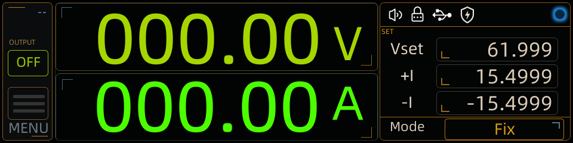

# Figma → GUI Guider 2.0 → LVGL 9.4

[English](README_EN.md) | 简体中文

[](https://github.com/houhouoch/Figma--GuiGuider2.0_V9.4-/actions/workflows/validate.yml)

这是一个经过实项目验证的 **Figma 到 NXP GUI Guider 2.0 / LVGL 9.4** 受控转换仓库。它不仅保存最终 GUI Guider 工程，还包含版本化 Manifest、转换与审计工具、工程复盘、Obsidian 原子笔记，以及可直接安装到 Codex 的 Skill。

> 本仓库专注于 Figma → GUI Guider。它不包含 MDK 工程，也不会自动修改固件业务代码。



## 已验证范围

- 画布：`960 × 240`
- Figma 设计根节点：31 个
- GUI Guider 工程条目：34 个（含系统层）
- V9 Manifest 节点：1756 个
- 文本审计：664 个标签
- 项目图片资源：50 个
- 目标：GUI Guider 2.0、LVGL 9.4、RGB565

完整过程见：

- [全流程工程复盘](docs/2026-07-30_FIGMA_TO_GUI_GUIDER_FULL_RETROSPECTIVE.md)
- [字体与 Label 复盘](docs/2026-07-29_GUI_GUIDER_FONT_AND_LABEL_RETROSPECTIVE.md)
- [Figma → GUI Guider 2.0 / LVGL 9.4 指南](docs/FIGMA_TO_GUI_GUIDER_2_0_LVGL_9_4_GUIDE.md)
- [工作流与避坑说明](docs/FIGMA_TO_LVGL_WORKFLOW_AND_PITFALLS.md)

## 仓库结构

```text
project/                  GUI Guider 模板工程和项目图片
manifests/                版本化 Figma 结构化快照
tools/                    转换、比较、审计、晋升和往返校验脚本
skills/                   Codex Skill
docs/                     指南、复盘和验证证据
knowledge-export/obsidian 可直接导入 Obsidian 的原子笔记
.github/                  CI、Issue 和 PR 规范
```

仓库不包含：

- NXP GUI Guider 安装包、`platform/` 或模拟器工具链；
- MDK 工程；
- GUI Guider 自动生成的 C 文件；
- 第三方字体二进制。

这样可以避免上传构建缓存、绝对路径和许可证不明确的第三方资产。

## 快速开始

### 1. 克隆

```bash
git clone https://github.com/houhouoch/Figma--GuiGuider2.0_V9.4-.git
cd Figma--GuiGuider2.0_V9.4-
```

### 2. 安装外部依赖

1. 从 [NXP 官方页面](https://www.nxp.com/design/software/development-software/gui-guider:GUI-GUIDER) 安装 GUI Guider 2.0，并接受其许可。
2. 从 [阿里巴巴普惠体官方页面](https://done.alibabadesign.com/puhuiti2.0) 获取 2.0 Regular TTF。

字体没有直接提交到本仓库。项目需要的目标文件名固定为：

```text
AlibabaPuHuiTi2.ttf
```

### 3. 生成本机可打开工程

Windows 示例：

```powershell
python tools/prepare_local_project.py `
  --font "D:\资料\AlibabaPuHuiTi-2\AlibabaPuHuiTi-2-55-Regular\AlibabaPuHuiTi2.ttf"
```

脚本会：

- 复制字体到 `project/resources/font/AlibabaPuHuiTi2.ttf`；
- 把 GUI Guider 的 `projectPath` 改成当前克隆目录的绝对路径；
- 生成 `project/guiguider_2.0.guiguider`。

然后在 GUI Guider 2.0 中打开：

```text
project/guiguider_2.0.guiguider
```

不要直接打开 `*.template.guiguider`。

如需从历史脚本重新生成项目图片，还需要把已获授权的原始素材放入
`external-assets/source/`，或设置 `FIGMA_GUI_GUIDER_ASSET_ROOT`。仅打开和审查
已发布 GUI Guider 工程不需要这一步。

### 4. 校验

```bash
python tools/validate_repository.py
python skills/figma-to-guiguider-controlled-sync/scripts/audit_guiguider_project.py \
  --project project/guiguider_2.0.guiguider
```

第二条命令应在执行本地准备脚本后运行。

### 5. 生成 LVGL 代码

在 GUI Guider 中点击 **Generate Code**。生成目录不纳入本仓库；生成后必须检查字体符号的引用、声明和定义是否一致，并执行一次完整模拟器构建。

## 安装 Codex Skill

使用 Skills CLI：

```bash
npx skills add https://github.com/houhouoch/Figma--GuiGuider2.0_V9.4-.git \
  --skill figma-to-guiguider-controlled-sync
```

或手动复制：

```text
skills/figma-to-guiguider-controlled-sync
```

到：

```text
%USERPROFILE%\.codex\skills\figma-to-guiguider-controlled-sync
```

调用示例：

```text
使用 $figma-to-guiguider-controlled-sync，
只同步指定 Figma 页面到 GUI Guider 2.0 候选工程，
保留正式工程的对象 ID、事件、变量、字体和项目配置。
```

## 受控同步原则

```text
Figma 完整快照
  → 版本化 Manifest
  → 语义差异与字段所有权审计
  → 独立候选工程
  → 资源闭包与字体审计
  → 视觉比较
  → 用户批准
  → 备份并晋升正式工程
  → GUI Guider 打开/保存/关闭往返
  → Generate Code + Simulator Build
```

严禁把不完整或限流后的快照当成有效 Manifest，也严禁直接把转换结果覆盖到正式 `.guiguider`。

## 许可与第三方内容

仓库中的原创自动化脚本和 Codex Skill 使用 MIT License。GUI 设计、图片、第三方字体、NXP GUI Guider 和 LVGL 分别受各自权利与许可约束。详情见 [THIRD_PARTY_NOTICES.md](THIRD_PARTY_NOTICES.md)。

## 贡献

请阅读 [贡献指南](CONTRIBUTING.md)。提交转换器修改时，必须同时提供：

- 固定输入 Manifest；
- 候选工程输出；
- 幂等性证据；
- 结构、资源、字体和视觉验证结果；
- 明确的正式工程保护范围。
